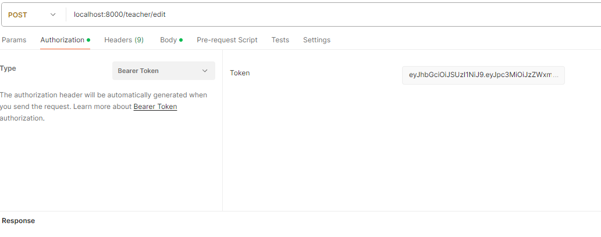

<div align="center">
<pre>
  ███████╗   █████╗  ██████╗  ███████╗ ██████╗    ██████╗ 
  ██╔════╝  ██╔══██╗ ██╔══██╗ ██╔════╝ ██╔══██╗  ██╔════╝ 
 ██║  ███╗ ███████║ ██║  ██║ ███████╗ ██████╔╝ ╚█████╗  
 ██║   ██║ ██╔══██║ ██║  ██║ ██╔════╝ ██╔══██╗  ╚═══██╗ 
╚██████╔╝ ██║  ██║ ██████╔╝ ███████╗ ██║  ██║ ██████╔╝
 ╚═════╝  ╚═╝  ╚═╝ ╚═════╝  ╚══════╝ ╚═╝  ╚═╝ ╚═════╝
---------------------------------------------------
Grading API For Teachers
</pre>

</div>

## If you're part of a hiring team looking over this project.
I've taken the liberty of creating a short 5-minute loom video quickly going over all main points in my project and showcasing how it works
using the Demo UI. you can view it [here](https://www.loom.com/share/7de74c5d28154b4183acc75816a6b2ff?sid=24a317bb-af7a-41fb-b20a-4ae3b0a45b24).
If you wish to test the program out your self here is a neat tool that can send and receive HTTP request and responses.
[](https://app.getpostman.com/run-collection/94e5460c770f01bda6ce#?env%5BDEV%5D=W3sia2V5IjoiYmFzZV91cmwiLCJ2YWx1ZSI6Imh0dHA6Ly9sb2NhbGhvc3Q6NDUwMCIsImVuYWJsZWQiOnRydWV9LHsia2V5IjoiaW5zaWRlcl9iYXNlX3VybCIsInZhbHVlIjoiaHR0cDovL2xvY2FsaG9zdDo5MDAwIiwiZW5hYmxlZCI6dHJ1ZX0seyJrZXkiOiJwdF9iYXNlX3VybCIsInZhbHVlIjoiaHR0cDovL2xvY2FsaG9zdDo1MDAwIiwiZW5hYmxlZCI6dHJ1ZX1d)

## Description

This project was made for High school and Middle School teachers to keep track of student grades and do repetitive task automatically.
Using Spring boot, spring security, Auth02, JWT, RSA, H2, AWS RDS, And PostgreSQL. I've also created a DEMO UI to showcase my backend project
you can view the UI [here](https://github.com/AndrewL14/Student-tracker-UI).


## Installation

### Pre-requisites 
- Java 17 or greater
- IntelliJ or VS Code (optimal)
- Postman for testing 


To Install the application fork the repo and clone it to your local machine.

### Disclaimer
`UI in development`

Note: If running in dev mode the data will not be stored across runtimes as the project uses an H2 database
Configuration for testing and dev work. During a future update, this project will be deployed using AWS and Render.

If you wish to deploy this project for yourself, create an application-prod.properties file and 
Configure accordingly

### Documentation
[](documentation/ClassRelationsSimplified.puml)
or visit the [compressive Diagram](documentation/ClassRelations.puml)

for information involving the new mailing system and request go to [Email Systems](documentation/EmailServiceDoc/EMAIL_DOCUMENTATION.md)

## Sample request
The way the project is set up you will need to log in before calling any methods, as you will need a 
VALID JWT to call the other methods. And make sure the program is running. 

[](https://app.getpostman.com/run-collection/94e5460c770f01bda6ce#?env%5BDEV%5D=W3sia2V5IjoiYmFzZV91cmwiLCJ2YWx1ZSI6Imh0dHA6Ly9sb2NhbGhvc3Q6NDUwMCIsImVuYWJsZWQiOnRydWV9LHsia2V5IjoiaW5zaWRlcl9iYXNlX3VybCIsInZhbHVlIjoiaHR0cDovL2xvY2FsaG9zdDo5MDAwIiwiZW5hYmxlZCI6dHJ1ZX0seyJrZXkiOiJwdF9iYXNlX3VybCIsInZhbHVlIjoiaHR0cDovL2xvY2FsaG9zdDo1MDAwIiwiZW5hYmxlZCI6dHJ1ZX1d)

Replace YOUR_ACCESS_TOKEN with the JWT you get when logging in. 
When using Postman put the JWT in authorization -> type -> bearer token. For any request that need it.


### POST Register
```sh 
curl -X POST -H "Content-Type: application/json" -d '{"username": "your_username", "email": "<your_email>"  "password": "your_password"}' http://localhost:5000/auth/register
```
```json
{
  "username": "example",
  "email": "email",
  "password": "password"
}
```
### POST Log in
``` sh
curl -X POST -H "Content-Type: application/json" -d '{"username": "james", "password": "password"}' http://localhost:5000/auth/login/basic
```
```json
{
  "username": "james",
  "password": "password"
}
```

All other requests are in Postman. In the Auth tab select `Bearer Token` and put your JWT in.
request files are formatted in `.yaml` to show what is needed, for requests requiring a body, a
corresponding `.json` format has been provided for quick copy and paste.

Here is all the necessary information needed to carry out requests in Postman:
### GET all students
```yaml
request:
  method: GET
  url: http://localhost:5000/teacher/all
  headers:
    Authorization: "Bearer YOUR_ACCESS_TOKEN"
```
### GET student by name
```yaml
request_get_unique_student:
  method: GET
  url: http://localhost:5000/teacher/unique?studentName=John%20Smith
  headers:
    Authorization: "Bearer YOUR_ACCESS_TOKEN"
```
### PUT add student
```yaml
request_put_add_student:
  method: PUT
  url: http://localhost:5000/teacher/add
  headers:
    Authorization: "Bearer YOUR_ACCESS_TOKEN"
  body:
    name: "John Doe"
    period: 2
    grade: 75
```
```json
{
  "name": "John Doe",
  "period": 2,
  "grade": 75
}
```
### POST edit student
```yaml
request_post_edit_student:
  method: POST
  url: http://localhost:5000/teacher/edit
  headers:
    Authorization: "Bearer YOUR_ACCESS_TOKEN"
  body:
    studentId: 1
    periodToChange: 2
    nameToChange: colin
```
```json
{
   "studentId": 1,
   "periodToChange": 2,
   "nameToChange": "colin"
}
```
### DELETE student
```yaml
request_delete_delete_student:
  method: DELETE
  url: http://localhost:5000/teacher/delete
  headers:
    Authorization: "Bearer YOUR_ACCESS_TOKEN"
  body:
    studentName: "jhon Smith"
```
```json
{
  "studentName": "jhon Smith"
}
```
## Development setup
1. Fork Repo
2. Clone Repo
3. Uncomment beaned command line runner in StudentTrackerApiApplication.class If needed
4. Set Application.properties file to run application-dev
`spring.profiles.active=dev`
5. If needed configure application-dev file to fit your needs
   These are the default parameters for the H2 database
```
spring.datasource.url=jdbc:h2:file:/data/demo;MODE=PostgreSQL;DATABASE_TO_LOWER=TRUE
spring.datasource.driverClassName=org.h2.Driver
spring.datasource.username=sa
spring.datasource.password=password
spring.jpa.database-platform=org.hibernate.dialect.H2Dialect

spring.jpa.show-sql=false
spring.jpa.hibernate.ddl-auto=create-drop
```
6. Run Application

## Meta

A. Lam – andrew.lam965@Gmail.com
Github profile
[https://github.com/AndrewL14/](https://github.com/AndrewL14/)

## Contributing

1. Fork it (<https://github.com/AndrewL14/Student-tracker-API/fork>)
2. Create your feature branch (`git checkout -b feature/fooBar`)
3. Commit your changes (`git commit -am 'Add some fooBar'`)
4. Push to the branch (`git push origin feature/fooBar`)
5. Create a new Pull Request
