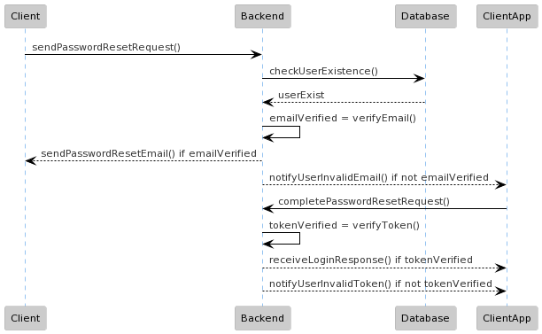
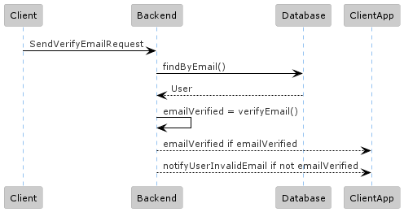

# Email Documentation

## Description

Describing how the electronic mailing system works including verification and password reset.
This project uses H2 database for testing and development the full application will use AWS RDS
to store data.

Currently, there is no need to verify your email to send other request including password reset.

## Disclaimer
The email sender service uses a dummy gmail account and NOT
A 3rd party Web API for development and testing. In the production grade
project will be integrated with a 3rd party email sender service to allow for 
multiple request.

To test this service Without a separate dev email API registers send 
a register request with a valid email address.

### Diagram
Password reset:

[](PasswordResetSystem.puml)

Email Verification:

[](EmailVerificationSystem.puml)

## Sample Request

These request will not require a JWT token to authorize. 

REPLACE `your_token` with the token you get when registering for verify email.

REPLACE `your_token` with the token you get when sending an initiate password reset for complete password reset.
### POST Register
```sh 
curl -X POST -H "Content-Type: application/json" -d '{"username": "<your_username>", "email": "<your_email>", password": "<your_password>"}' http://localhost:8000/auth/register
```
pre-made user for testing and development. This user has a dummy email that doesn't work.

go to `StudentTrackerApiApplication.java`  if you wish to change the parameters.
### POST Log in by username
``` sh
curl -X POST -H "Content-Type: application/json" -d '{"username": "james", "password": "password"}' http://localhost:8000/auth/login/basic
```
### POST Log in by email
``` sh
curl -X POST -H "Content-Type: application/json" -d '{"email": "example@gmail.com", "password": "password"}' http://localhost:8000/auth/login/email
```

You get the verification email when you register automatically.
### GET Verify email
``` sh
curl -X GET http://localhost:8000/auth/verify/email?token=<your_token>
```

### Send verification link
``` sh
curl -X GET http://localhost:8000/auth/verify/send?email=<your_email>
```

### POST Initiate password reset
``` sh
curl -X POST http://localhost:8000/auth/initiate-reset?email=<your_email>
```

### POST Complete password reset
``` sh
curl -X POST -H "Content-Type: application/json" -d '{"token": "<your_token>", "password": "password"}' http://localhost:8000/auth/reset-password
```

```yaml
request_put_add_student:
  method: POST
  url: http://localhost:8000/auth/reset-password
  body:
    token: "<your_token>"
    password: "password"
```