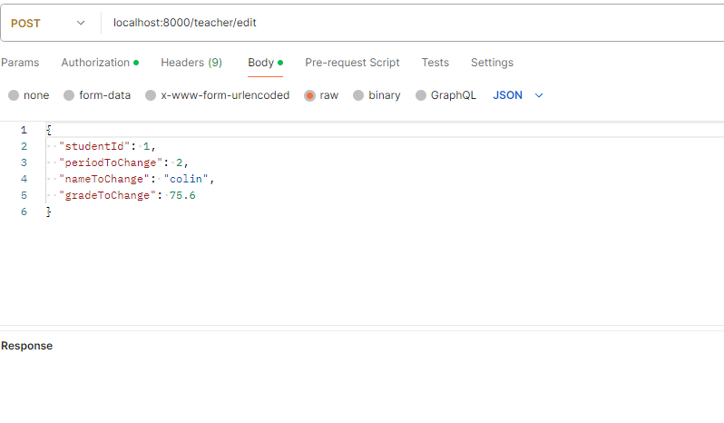

# Endpoint documentation


The way the project is set up you will need to log in before calling any methods, as you will need a
VALID JWT to call the other methods. And make sure the program is running.
Replace YOUR_ACCESS_TOKEN with the JWT you get when logging in.
When using Postman put the JWT in authorization -> type -> bearer token. For any request that need it.

Application will be running on localhost:5000 on dev mode.




## Authentication request
___

### POST Register
```sh 
curl -X POST -H "Content-Type: application/json" -d '{"username": "your_username", "email": "<your_email>"  "password": "your_password"}' http://localhost:5000/auth/register
```
```json
{
  "username": "example",
  "email": "email",
  "password": "password"
}
```
### POST Log in
``` sh
curl -X POST -H "Content-Type: application/json" -d '{"username": "james", "password": "password"}' http://localhost:5000/auth/login/basic
```
```json
{
  "username": "james",
  "password": "password"
}
```
All other requests are in Postman. In the Auth tab select `Bearer Token` and put your JWT in.
request files are formatted in `.yaml` to show what is needed, for requests requiring a body, a
corresponding `.json` format has been provided for quick copy and paste.

Here is all the necessary information needed to carry out requests in Postman:

## Student request
___
### GET all students
You will need to also but an empty body when sending the request.
```yaml
request:
  method: GET
  url: http://localhost:5000/teacher/all
  headers:
    Authorization: "Bearer YOUR_ACCESS_TOKEN"
  body:
```
### GET student by name
```yaml
request_get_unique_student:
  method: GET
  url: http://localhost:5000/teacher/unique?studentName=John%20Smith
  headers:
    Authorization: "Bearer YOUR_ACCESS_TOKEN"
```
### PUT add student
```yaml
request_put_add_student:
  method: PUT
  url: http://localhost:5000/teacher/add
  headers:
    Authorization: "Bearer YOUR_ACCESS_TOKEN"
  body:
    name: "John Doe"
    period: 2
    grade: 75
```
```json
{
  "name": "John Doe",
  "period": 2,
  "grade": 75
}
```
### POST edit student
```yaml
request_post_edit_student:
  method: POST
  url: http://localhost:5000/teacher/edit
  headers:
    Authorization: "Bearer YOUR_ACCESS_TOKEN"
  body:
    studentId: 1
    periodToChange: 2
    nameToChange: colin
```
```json
{
   "studentId": 1,
   "periodToChange": 2,
   "nameToChange": "colin"
}
```
### DELETE student
```yaml
request_delete_delete_student:
  method: DELETE
  url: http://localhost:5000/teacher/delete
  headers:
    Authorization: "Bearer YOUR_ACCESS_TOKEN"
  body:
    studentName: "Jhon Smith"
```
```json
{
  "studentName": "Jhon Smith"
}
```
## Assignment request
___
## Endpoints

```yaml
endpoints:
  - path: "/student/get-student{id}"
    method: "GET"
    description: "Get student by ID."
    request_params:
      - name: "id"
        type: "Long"
        description: "ID of the student."
    headers:
      - name: "Authorization"
        type: "string"
        description: "JWT token for authentication."

  - path: "/student/get-all{id}"
    method: "GET"
    description: "Get all assignments for a student."
    request_params:
      - name: "id"
        type: "Long"
        description: "ID of the student."
    headers:
      - name: "Authorization"
        type: "string"
        description: "JWT token for authentication."

  - path: "/student/add"
    method: "PUT"
    description: "Add a new assignment for a student."
    request_body:
      type: "AddAssignmentRequest"
      description: "Request body containing details of the assignment to be added."
    headers:
      - name: "Authorization"
        type: "string"
        description: "JWT token for authentication."

  - path: "/student/update-status/"
    method: "POST"
    description: "Update assignment status for a student."
    request_body:
      type: "UpdateAssignmentStatusRequest"
      description: "Request body containing student ID and assignment ID to update status."
    headers:
      - name: "Authorization"
        type: "string"
        description: "JWT token for authentication."

  - path: "/student/edit"
    method: "POST"
    description: "Edit an existing assignment for a student."
    request_body:
      type: "EditAssignmentRequest"
      description: "Request body containing details of the assignment to be edited."
    headers:
      - name: "Authorization"
        type: "string"
        description: "JWT token for authentication."

  - path: "/student/delete"
    method: "DELETE"
    description: "Delete an assignment for a student."
    request_body:
      type: "DeleteAssignmentRequest"
      description: "Request body containing details of the assignment to be deleted."
    headers:
      - name: "Authorization"
        type: "string"
        description: "JWT token for authentication."

```
## request body objects
___
```yaml
AddAssignmentRequest:
  type: object
  properties:
    studentId:
      type: integer
      description: "ID of the student."
    assignmentName:
      type: string
      description: "Name of the assignment."
    grade:
      type: number
      format: double
      description: "Grade of the assignment."
    completed:
      type: boolean
      description: "Indicates if the assignment is completed or not."
    dueDate:
      type: string
      format: date
      description: "Due date of the assignment. Format: yyyy-MM-dd."
    assignmentType:
      type: string
      description: "Type of the assignment."

DeleteAssignmentRequest:
  type: object
  properties:
    studentId:
      type: integer
      description: "ID of the student."
    assignmentId:
      type: integer
      description: "ID of the assignment to be deleted."

EditAssignmentRequest:
  type: object
  properties:
    studentId:
      type: integer
      description: "ID of the student."
    assignmentId:
      type: integer
      description: "ID of the assignment to be edited."
    assignmentNameToChange:
      type: string
      description: "New name for the assignment."
    gradeToChange:
      type: number
      format: double
      description: "New grade for the assignment."
    dueDateToChange:
      type: string
      format: date
      description: "New due date for the assignment. Format: yyyy-MM-dd."
    assignmentTypeToChange:
      type: string
      description: "New type for the assignment."

UpdateAssignmentStatusRequest:
  type: object
  properties:
    studentId:
      type: integer
      description: "ID of the student."
    assignmentId:
      type: integer
      description: "ID of the assignment to update status."

```

